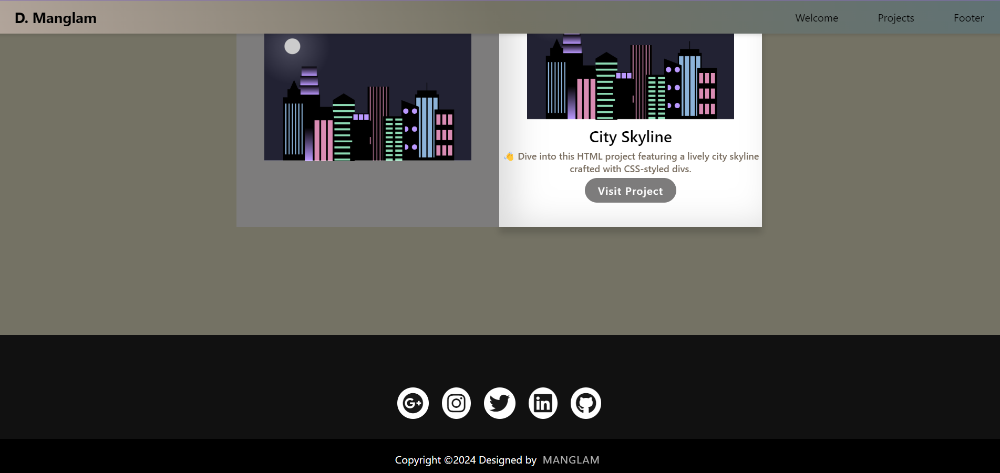

# Personal Portfolio



## Description

This is a personal portfolio website designed and developed by [Manglam](https://github.com/Manglam11). It showcases projects, contact information, and social media links.

## Features

- Responsive design for various screen sizes.
- Navigation menu with smooth scrolling.
- Projects section with project tiles.
- Contact section with social media icons.
- Footer with copyright information.

## Technologies Used

- HTML
- CSS
- Font Awesome
- Google Fonts

## Installation

1. Clone the repository:

   ```bash
   git clone https://github.com/Manglam11/portfolio_first.git

   ```

2. Open the index.html file in your web browser.

# Live Preview

You can view the live version of this project [here](add_your_live_preview_link).

## Usage

- Navigate through the website using the navigation menu.
- Explore projects by clicking on the project tiles.
- Connect with the developer on social media.

## Credits

- Font Awesome
- Google Fonts

## License

This project is licensed under the MIT License - see the [LICENSE](LICENSE) file for details.
